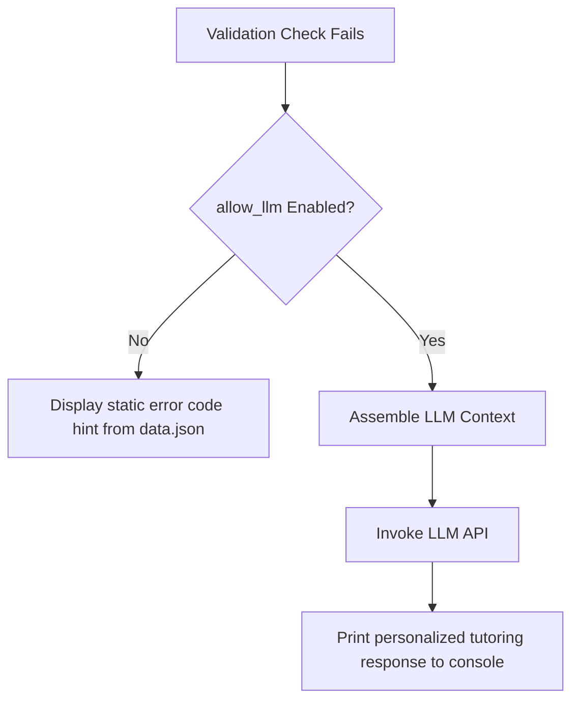

# Implementation Details

This document records concrete implementation specifications, CLI command details, helper functions, and platform-specific logic for the **revex** learning platform.

---

## 1. CLI Commands Specification

The CLI tool, invoked via `revex`, supports the following user-facing commands:

### A. Workspace Setup (`setup`)
* **Usage:** `uv run revex setup`
* **Behavior:** 
  - Creates the user workspace folder: `/workspace`
  - Creates the user data folder: `/.user_data`
  - Generates the initial configuration file: `/.user_data/config.toml`
  - Generates the empty progress tracking file: `/.user_data/progress.json`
  - Runs the initial workspace synchronization.

### B. Progress Status (`status`)
* **Usage:** `uv run revex status`
* **Behavior:** 
  - Loads progress from `/.user_data/progress.json`
  - Prints statistics of completed exercises grouped by modules.

### C. Validation Check (`check`)
* **Usage:** `uv run revex check workspace/<group_name>/<exercise_id>-<exercise_name>/<exercise_name>.py`
* **Behavior:** 
  - Infers exercise ID from the file path.
  - Executes the generic AST-based validator using declarations from `data.json`.
  - Executes static type-checking validation using `pyright`.
  - If validation passes, updates progress in `progress.json`.
  - If validation fails, prints localized hints from `data.json`.

### D. Settings Management (`set`)
* **Usage:** `uv run revex set --language <lang>`
* **Behavior:** 
  - Updates the language setting in `/.user_data/config.toml` (e.g., `en` or `es`).

### E. Workspace Sync (`sync`)
* **Usage:** `uv run revex sync`
* **Behavior:** 
  - Syncs the workspace with `manifest.json`.
  - Exclusively copies `exercise.py` and the localized problem markdown file (saved as `README.md`) into the workspace directory.

### F. Exercise Viewer (`view`)
* **Usage:** `uv run revex view <id>`
  - Render and display the problem description for the specified exercise ID in the terminal.
* **Usage:** `uv run revex view next`
  - Render and display the problem description for the next unsolved exercise in the curriculum.
* **Behavior:**
  - Navigates to the corresponding exercise directory in `/workspace/`.
  - Renders the `README.md` to the console using the system utility `glow`.

---

## 2. Terminal Markdown Previewer Utility

To render problem markdown files natively in the user's terminal, the CLI leverages the system-level command `glow`.

### Implementation Code Ideas

The CLI uses the following Python helper function to invoke `glow`:

```python
import subprocess
import sys

def preview_markdown(file_path: str) -> None:
    """Invokes the system's glow command to render markdown in the terminal."""
    try:
        subprocess.run(["glow", file_path], check=True)
    except subprocess.CalledProcessError as e:
        print(f"Error running glow: {e}", file=sys.stderr)
    except FileNotFoundError:
        print("Error: Glow is not installed on your system.", file=sys.stderr)
```

### Glow Dependency and OS Installer Guidance

If `glow` is not detected in the system `PATH`, the CLI warns the user and suggests instructions based on their operating system:

```python
import platform
import shutil

def is_glow_installed() -> bool:
    """Validates whether the 'glow' binary is present in the system PATH."""
    return shutil.which("glow") is not None

def get_glow_install_instructions() -> str:
    """Detects the host OS and returns host-specific installation instructions."""
    system = platform.system().lower()

    if system == "darwin":
        return (
            "💡 Suggested installation for macOS (Homebrew):\n"
            "brew install glow"
        )

    if system == "windows":
        return (
            "💡 Suggested installation for Windows:\n"
            "winget install charmbracelet.glow\n"
            "OR\n"
            "scoop install glow"
        )

    if system == "linux":
        try:
            with open("/etc/os-release") as f:
                os_data = {}
                for line in f:
                    if "=" in line:
                        key, value = line.rstrip().split("=", 1)
                        os_data[key] = value.strip('"')
            
            os_id = os_data.get("ID", "").lower()
            id_like = os_data.get("ID_LIKE", "").lower().split()
        except FileNotFoundError:
            return "❌ Could not determine Linux distribution (/etc/os-release missing)."

        if os_id in ["ubuntu", "debian", "pop", "mint"] or "debian" in id_like or "ubuntu" in id_like:
            return (
                "💡 Suggested installation for Debian/Ubuntu:\n"
                "sudo mkdir -p /etc/apt/keyrings && "
                "curl -fsSL https://charm.sh | sudo gpg --dearmor -o /etc/apt/keyrings/charm.gpg && "
                'echo "deb [signed-by=/etc/apt/keyrings/charm.gpg] https://charm.sh * *" | sudo tee /etc/apt/sources.list.d/charm.list && '
                "sudo apt update && sudo apt install glow"
            )

        if os_id in ["fedora", "rhel", "centos", "rocky", "almalinux"] or "fedora" in id_like or "rhel" in id_like:
            return (
                "💡 Suggested installation for Fedora/RHEL:\n"
                "echo -e '[charm]\\nname=Charm\\nbaseurl=https://charm.sh\\nenabled=1\\ndpgcheck=1\\ndpgkey=https://charm.shgpg.key' | sudo tee /etc/yum.repos.d/charm.repo && "
                "sudo dnf install glow"
            )

        if os_id in ["arch", "manjaro"] or "arch" in id_like:
            return "💡 Suggested installation for Arch Linux:\nsudo pacman -S glow"

        if os_id == "alpine":
            return "💡 Suggested installation for Alpine Linux:\nsudo apk add glow"

        return (
            "💡 Unrecognized Linux distribution. Suggested universal installation:\n"
            "sudo snap install glow\n"
            "OR\n"
            "flatpak install flathub sh.charm.Glow"
        )

    return (
        f"❌ Unsupported OS: {platform.system()}.\n"
        "Please install Glow manually from: https://github.com/charmbracelet/glow"
    )
```

---

## 3. Planned Feature: LLM-Generated Interactive Hints

To enhance the feedback loop, the CLI can optionally call an LLM (local instance or public API) to generate personalized feedback instead of showing static hints when validation checks fail.

### Control Flow Logic



### Context Assembly for Prompting
When invoking the LLM, the CLI should build a detailed context object containing:
- **Exercise Metadata:** ID, title, learning goals, and tags.
- **Problem Statement:** The markdown description in the learner's chosen language.
- **Validation Spec:** The expected annotations/rules from `data.json`.
- **Learner's Current Solution:** The contents of the modified `<exercise_name>.py` file.
- **Linter/Static Analysis Diagnostics:** Output from Pyright or AST checks (e.g., which line/annotation failed).

### Prompt Guidelines (System Prompt)
The system prompt should restrict the LLM behavior to act as an encouraging, Socratic tutor:
1. Do not output the direct answer or solution code block.
2. Guide the learner by asking questions or pointing out syntax discrepancies on specific line numbers.
3. Keep the feedback concise and format output using standard markdown.

