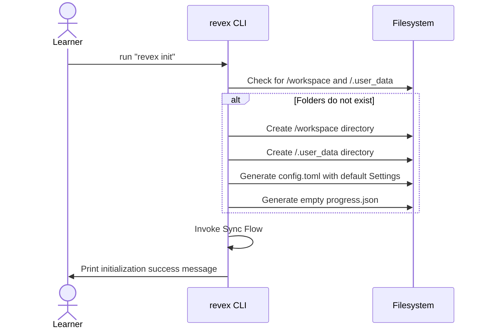
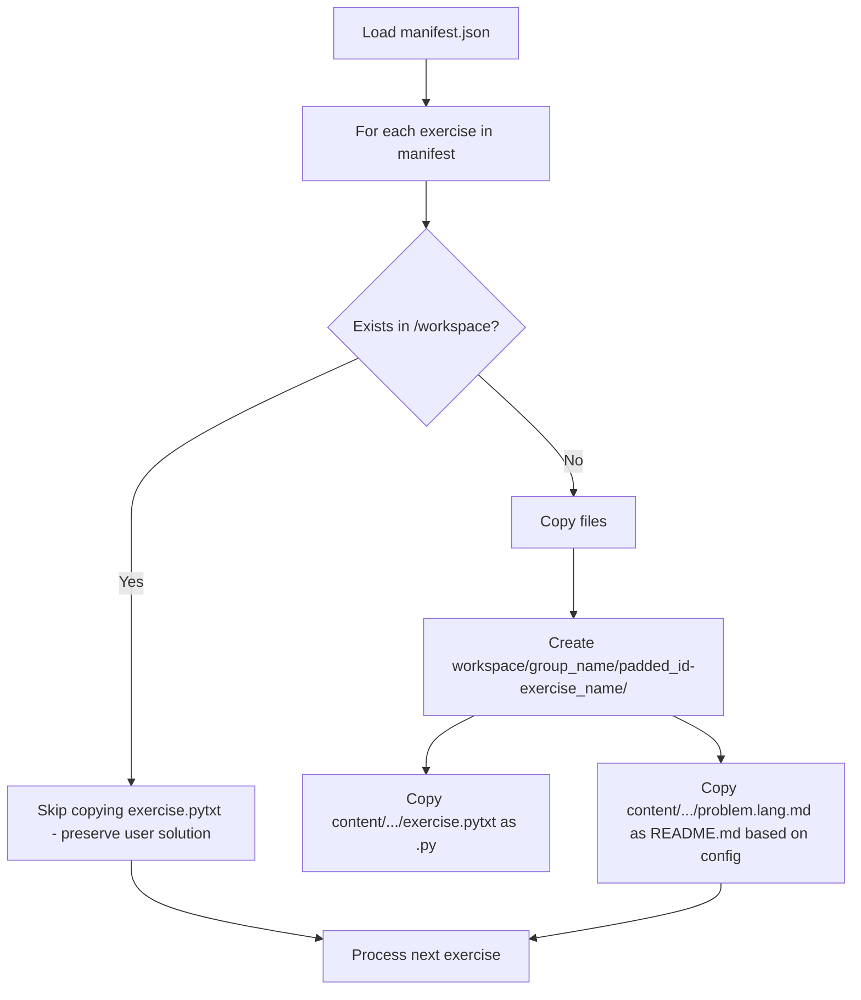
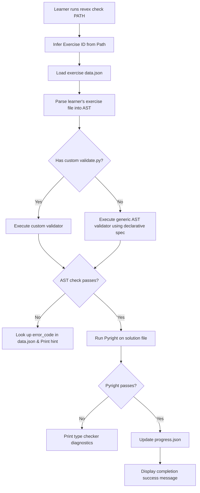
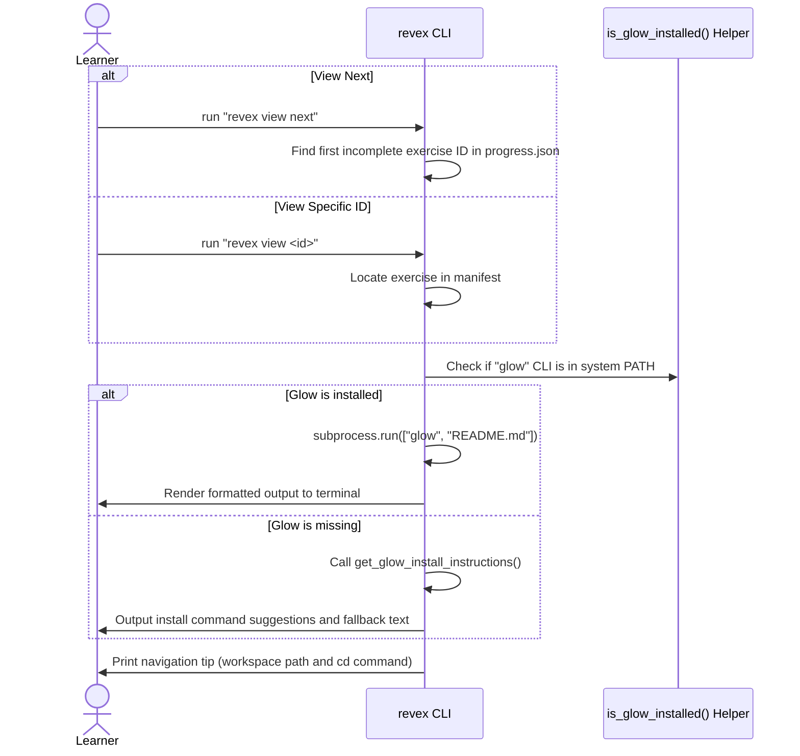

# CLI Workflow & Interaction Flows

This document details the command execution flows, terminal rendering behaviors, and sequence patterns of the **revex** CLI commands.

---

## 1. Setup Flow (`revex init`)

This command initializes a learner's environment. It is idempotent; if run multiple times, it will only create files/folders if they do not exist.

### Sequence Diagram

---

## 2. Synchronization Flow (`revex sync`)

This command keeps the user's workspace aligned with the central content catalog. It strictly respects the workspace model guarantees, ensuring existing user solutions are never overwritten.

### Sync Selection and File Mapping Logic

---

## 3. Validation Flow (`revex check`)

This command evaluates the learner's solution, orchestrating the declarative AST validation and Pyright static type check.

### Flowchart

---

## 4. Problem Viewer Flow (`revex view`)

This command outputs the formatted markdown description to the console.

### Sequence Diagram

