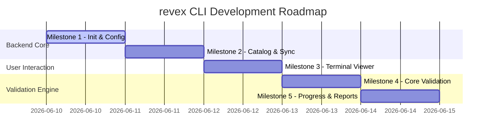

# Technical Implementation Plan

This document outlines the ordered milestones, component definitions, and architectural boundaries for implementing the **revex** CLI codebase.

---

## 1. Architectural Boundaries: Domain vs. Presentation

To maintain a clean codebase, the system is strictly divided into two layers:

```text
revex CLI
  ├── Presentation Layer (src/revex/main.py)
  │     └── Handles arguments, terminal IO, console output, and glow previewing.
  │
  └── Domain Layer (src/revex/core/services/ & src/revex/core/validators/)
        └── Handles config persistence, syncing files, AST validation, and Pyright checks.
```

### Presentation Layer (CLI)
- **Files:** [src/revex/main.py](../main.py)
- **Responsibilities:**
  - Argument parsing using standard library `argparse`.
  - Console rendering and string decoration (using ANSI escape codes).
  - Calling `glow` subprocesses for markdown previews.
  - Converting service return values (e.g. `ValidationErrorRecord` models) into clean terminal user feedback.
  - Exits with appropriate system shell codes (`0` on success, `1` on error).

### Domain Layer (Services & Validators)
- **Files:** `src/revex/core/services/` and [src/revex/core/validators/](../core/validators/)
- **Responsibilities:**
  - Standard filesystem operations (creating folders, copying templates).
  - Validation execution (AST checking, launching Pyright subprocesses).
  - JSON serialization of progress and TOML serialization of configuration.
  - Domain models validation using Pydantic.

---

## 2. Ordered Milestones 



### Milestone 1: Environment Initialization & Configuration
Establish the workspace and settings configuration pipeline.

* **Component Definitions:**
  - **Paths Helper (`services/paths.py`):** Canonical path mappings to `/workspace`, `/.user_data`, and `/content`.
  - **Config Service (`services/config.py`):** Functions to load, validate, and save `/.user_data/config.toml` using `Config` and `Settings` Pydantic models.
  - **Setup Service (`services/setup.py`):** Creates directories and initializes default files.
* **CLI Integration:**
  - Implement `revex init` command.
* **Verification Criteria:**
  - Running `revex init` creates `/workspace/` and `/.user_data/`, writing default configs.

---

### Milestone 2: Content Registry & Synchronization
Implement the content catalog parser and the synchronization file copy logic.

* **Component Definitions:**
  - **Manifest Service (`services/manifest.py`):** Loads and parses `content/manifest.json` using the `Manifest` model.
  - **Content Service (`services/content.py`):** Standardizes loaders for exercise files, translations, and templates from the package content directory.
  - **Sync Service (`services/sync.py`):** Compares manifest with workspace:
    - Creates `workspace/<group_name>/<padded_id>-<exercise_name>/`.
    - Copies `exercise.pytxt` as `<exercise_name>.py`.
    - Copies `problem.lang.md` as `README.md` based on active config.
* **CLI Integration:**
  - Implement `revex sync` command.
* **Verification Criteria:**
  - Running `revex sync` correctly creates `workspace/primitives/0101-basic_type_hints/basic_type_hints.py` and its accompanying English/Spanish `README.md`.

---

### Milestone 3: Problem Rendering & Terminal Preview
Build the terminal-based lesson description viewer.

* **Component Definitions:**
  - **Glow Checker (`services/glow_helper.py`):** Validates if the `glow` binary is in the system `PATH`. Returns OS-specific installation advice on failure.
* **CLI Integration:**
  - Implement `revex view <id>` and `revex view next`.
  - Flow: Checks `allow_glow` settings in config. If enabled and `glow` is present, renders markdown with glow. Otherwise, prints raw text or standard fallback.
* **Verification Criteria:**
  - Running `revex view 0101` prints the formatted problem statements in the terminal.

---

### Milestone 4: Core Validation Engine
Implement structural AST analysis and Pyright type diagnostics.

* **Component Definitions:**
  - **AST Validator (`validators/ast_validator.py`):** 
    - Loads `<exercise_name>.py` and parses it into `ast.AST`.
    - Iterates over variables matching rules in `ValidationSpec` annotations.
    - Asserts type hints match and generates `ValidationErrorRecord` on failure.
  - **Pyright Validator (`validators/pyright_validator.py`):**
    - Runs `pyright <file_path>` as a subprocess.
    - Captures stdout/stderr, checks exit codes, and reports errors.
  - **Validator Runner (`validators/runner.py`):**
    - Orchestrates AST check and Pyright check.
    - If all checks pass, calls progress service to record completion.
* **CLI Integration:**
  - Implement `revex check <file_path>`.
* **Verification Criteria:**
  - Unsolved exercises raise exact AST errors and Pyright diagnostics. Properly annotated solutions pass checks cleanly.

---

### Milestone 5: Progress Status & Reporting
Persist completion metrics and format overall user statistics.

* **Component Definitions:**
  - **Progress Service (`services/progress.py`):**
    - Updates local `progress.json` completion state.
    - Counts and logs test attempts.
    - Calculates module-by-module completion statistics.
* **CLI Integration:**
  - Implement `revex status` command.
* **Verification Criteria:**
  - Successfully checking an exercise updates the progress database and increments completions inside `revex status`.
