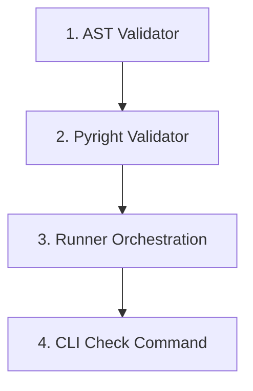

# Technical Plan: Milestone 4 — Core Validation Engine

This document outlines the detailed plan, component definitions, and implementation tasks for completing **Milestone 4** of the **revex** learning platform.

---

## 1. Objectives

- Parse the learner's workspace exercise file into an Abstract Syntax Tree (AST) and verify required type annotations declaratively (ADR 10).
- Run Pyright programmatically as a subprocess and parse its structured JSON diagnostic output.
- Orchestrate validation steps (AST checking first, followed by Pyright diagnostics check) in a runner.
- Resolve custom exercise validation error codes to localized hint messages defined in `data.json`.
- Implement `revex check <file_path>` CLI integration.

---

## 2. API Design & Component Definitions

### A. AST Validator (`src/revex/core/validators/ast_validator.py`)
Parses the target python file content into an AST and verifies the structure of variable type annotations.

```python
import ast
from pathlib import Path
from revex.core.models import ValidationErrorRecord, ValidationSpec

def validate_ast(file_path: Path, spec: ValidationSpec) -> list[ValidationErrorRecord]:
    """
    Parses file_path and checks variable annotations against ValidationSpec.
    Returns a list of ValidationErrorRecord for any missing or incorrect annotations.
    """
    ...

def assert_annotation(
    tree: ast.AST,
    variable_name: str,
    expected_type: str,
    error_code: str,
) -> ValidationErrorRecord | None:
    """
    Validates if the specified variable is annotated with the expected type.
    Returns ValidationErrorRecord if validation fails, or None if it passes.
    """
    ...
```

### B. Pyright Validator (`src/revex/core/validators/pyright_validator.py`)
Spawns a Pyright subprocess and collects static analysis type diagnostics.

```python
from pathlib import Path
from revex.core.models import ValidationErrorRecord

def validate_pyright(file_path: Path) -> list[ValidationErrorRecord]:
    """
    Runs pyright --json <file_path> as a subprocess.
    Parses the general diagnostics and maps severity "error" events
    to ValidationErrorRecord lists.
    """
    ...
```

### C. Validation Runner (`src/revex/core/validators/runner.py`)
Coordinates validation execution and progress persistence.

```python
from pathlib import Path
from revex.core.models import ValidationErrorRecord

def run_validation(file_path: Path) -> list[ValidationErrorRecord]:
    """
    Orchestrates the entire validation pipeline:
    1. Resolves the corresponding ManifestExercise and metadata (data.json).
    2. Runs AST validation.
    3. If AST validation has errors, halts and returns them (with localized hints populated).
    4. Runs Pyright validation.
    5. If all checks pass:
       - Marks exercise as completed in progress.json.
    6. Returns combined list of validation errors.
    """
    ...
```

---

## 3. Implementation Tasks



### Task 1: AST Validator Implementation
- Implement `validate_ast()` in `src/revex/core/validators/ast_validator.py`.
- Iterate through `ast.AnnAssign` nodes in the syntax tree.
- Use `ast.unparse(node.annotation)` (available in Python 3.9+) to normalize the annotation representation and compare it directly to `expected_type` strings.
- Account for missing variables or unannotated assignments.

### Task 2: Pyright Validator Integration
- Implement `validate_pyright()` in `src/revex/core/validators/pyright_validator.py`.
- Execute `pyright --json <file_path>` inside `subprocess.run()`.
- Parse output JSON, filtering for diagnostics with `"severity": "error"`.
- Convert line and character offsets to `ValidationErrorRecord` structure.

### Task 3: Validation Runner & Translation Resolver
- Write `run_validation()` in `src/revex/core/validators/runner.py`.
- Load active language configuration to map the correct translations.
- Resolve custom AST `error_code` markers (e.g. `PRIMITIVE_STR_001`) to the translation dict hints found in the exercise's `data.json`.
- If successful, import and trigger the progress service to mark the exercise as completed.

### Task 4: CLI Integration (`revex check`)
- Wire validation execution into `execute_check()` inside `src/revex/cli/commands.py`.
- If typecheck passes, output a successful check result (e.g., `✓ basic_type_hints.py: All checks passed!`).
- If validation fails, render formatted type errors, showing the line numbers, offending variables, and helpful localized hints.
