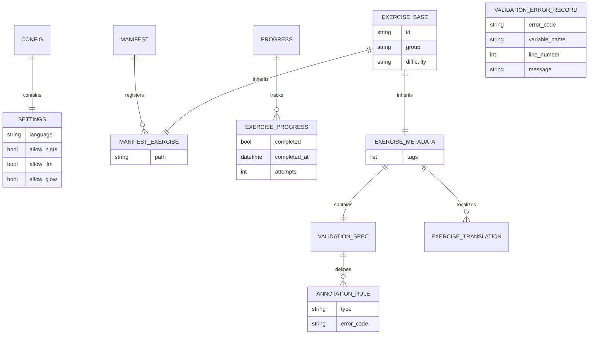
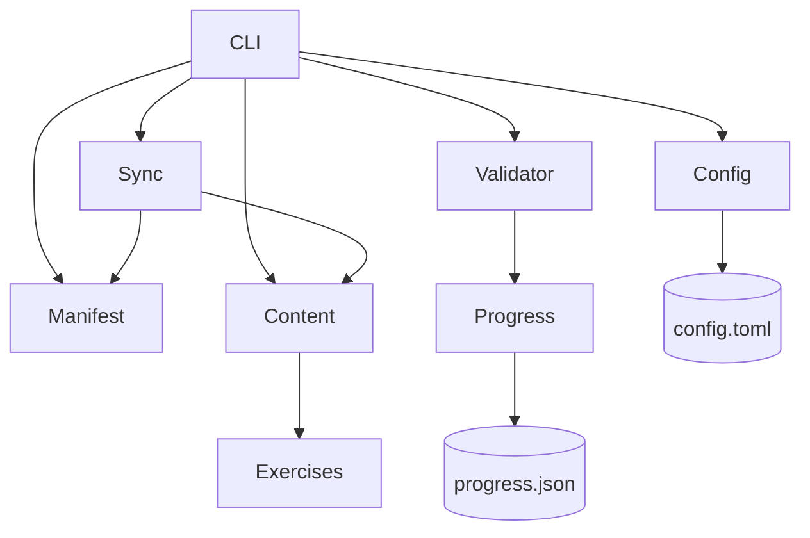

# Model Definitions & Architecture

This document describes the structure, relationships, and responsibilities of the core data models used by the **revex** platform.

---

## 1. Entity Relationship Diagram

---

## 2. Classes, Responsibilities, and Collaborators (CRC)

### ExerciseBase
* **Responsibility:** Holds the core identity and categorization fields (`id`, `group`, `difficulty`) shared across registry indices and domain metadata.
* **Collaborators:** [ManifestExercise](file:///home/kiskaadee/Projects/type-hints/src/revex/models/manifest.py#L12), [ExerciseMetadata](file:///home/kiskaadee/Projects/type-hints/src/revex/models/metadata.py#L33)

### ExerciseMetadata
* **Responsibility:** Represents the full domain definition loaded from an exercise's `data.json`, including localized strings and declarative validation rules.
* **Collaborators:** [ValidationSpec](file:///home/kiskaadee/Projects/type-hints/src/revex/models/metadata.py#L20), [ExerciseTranslation](file:///home/kiskaadee/Projects/type-hints/src/revex/models/metadata.py#L26), [Progress](file:///home/kiskaadee/Projects/type-hints/src/revex/models/progress.py#L20)

### Manifest
* **Responsibility:** Acts as the central offline registry index mapping exercise IDs to their canonical relative paths for workspace installation.
* **Collaborators:** [ManifestExercise](file:///home/kiskaadee/Projects/type-hints/src/revex/models/manifest.py#L12), Sync Service

### Progress
* **Responsibility:** Records completion state, attempt counts, and completion timestamps.
* **Collaborators:** [ExerciseProgress](file:///home/kiskaadee/Projects/type-hints/src/revex/models/progress.py#L12), Validator Runner, CLI

### Config
* **Responsibility:** Manages user configuration preferences, controlling interface language and enabling advanced helper extensions (e.g., interactive tutoring).
* **Collaborators:** [Settings](file:///home/kiskaadee/Projects/type-hints/src/revex/models/config.py#L19), CLI, LLM Helper

### ValidationErrorRecord
* **Responsibility:** Represents a structured validation check failure (either AST-based syntax error or Pyright type check diagnostic) returned by the validation runner to guide the learner.
* **Collaborators:** Validator Runner, CLI

---

## 3. System Overview Diagram

