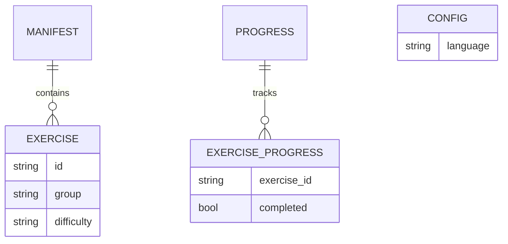

# Models definition

## Entity Relationship Diagram



## Classes, Responsabilities, and Colaborators

### Exercise
| Responsibility              | Collaborators  |
| --------------------------- | -------------- |
| Store exercise metadata     | Manifest       |
| Identify exercise content   | Content Loader |
| Provide difficulty and tags | Validator      |

### Manifest
| Responsibility               | Collaborators  |
| ---------------------------- | -------------- |
| Discover available exercises | Content Loader |
| Provide content version      | Sync           |
| Lookup exercise metadata     | Exercise       |

### Progress
| Responsibility            | Collaborators |
| ------------------------- | ------------- |
| Track completed exercises | Validator     |
| Generate status reports   | CLI           |
| Persist learner state     | Config        |

## System Overview Diagram

```mermaid
flowchart TD

    CLI --> Config

    CLI --> Manifest

    CLI --> Content

    CLI --> Sync

    CLI --> Validator

    Validator --> Progress

    Sync --> Manifest

    Sync --> Content

    Content --> Exercises

    Progress --> ProgressJSON

    Config --> ConfigTOML
  ```
